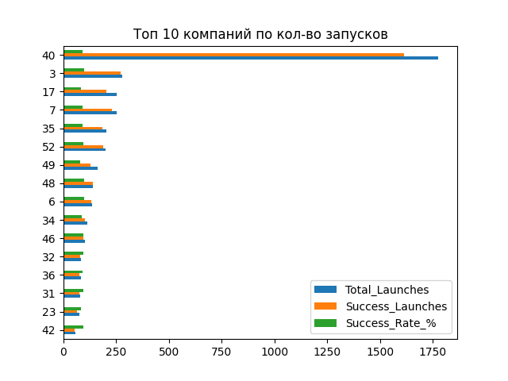
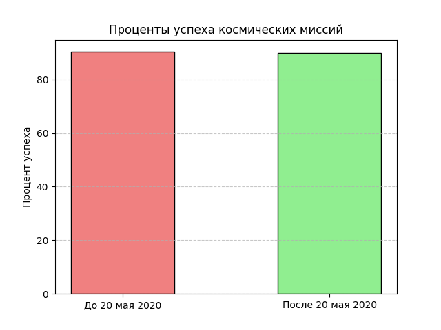
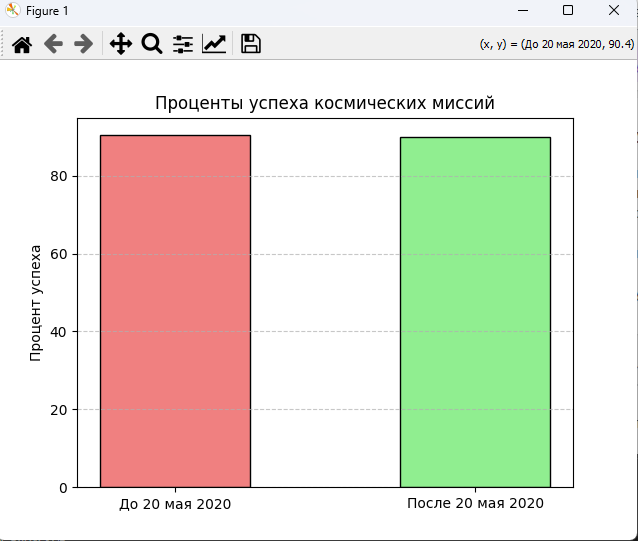
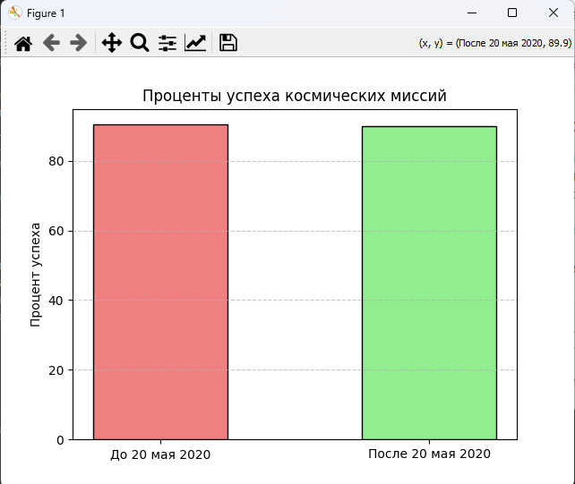

# Аналитический кейс на тему "Космические полёты"

## Содержание кейса

**9 столбцов:** название компании | локация | дата полёта | название ракеты и др.

**Идея продукта:** приложение по оценке рисков.

**Рынок:** космический туризм

**Целевая аудитория:** потенциальные космические туристы.

**Исследовательские вопросы:**

1. *Какие факторы влияют на успех запуска?*
  
2. *Зависит ли успех запуска от места и времени года?*

   
**Гипотезы:**
1. *Чем крупнее компания, тем успешнее запуск*
 
   *Чем сбалансирование бюджет, тем успешнее запуск*
   
   *Запуски после 20 мая 2020, успешнее*

2. *Чем ближе запуск к экватору, тем успешнее запуск*
 
   *Зимой и осенью успех запуска меньше*

## Вывод

**Выбранный исследовательский вопрос:** *Какие факторы влияют на успех запуска?*

1. **Чем крупнее компания, тем успешнее запуск:** *Не верна*

2. **Чем сбалансирование бюджет, тем успешнее запуск:** *Не верна*

3. **Запуски после 20 мая 2020, успешнее:** *Не верна*
  

